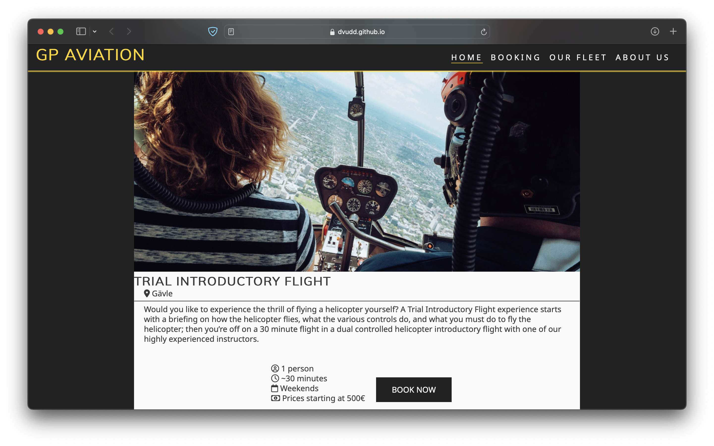
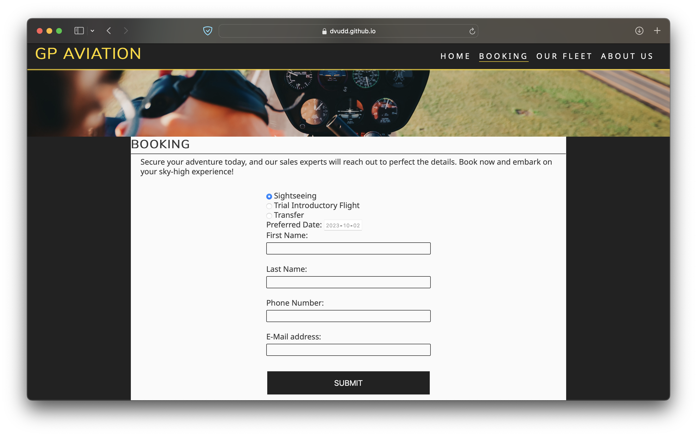
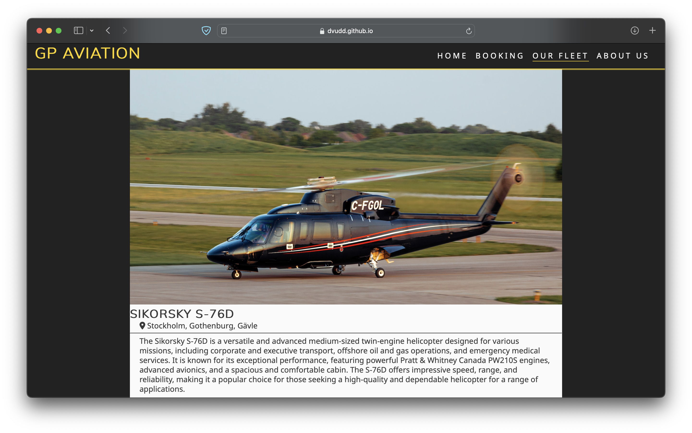
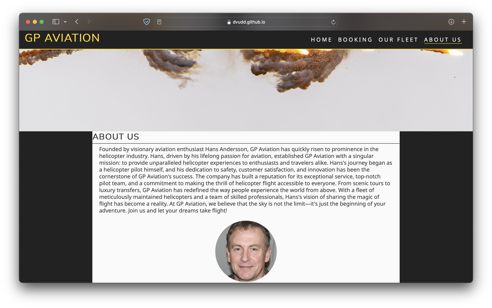

# GP Aviation

GP Aviation is a website for a hypothetical helicopter company based in Sweden focused on selling different experience trips, such as sightseeing tours around Stockholm, short learning sessions with instructors or luxurious transfer trips.

## Features
The site is fully responsive on all screen sizes.

### Navigation Bar

The Navigation bar is fixed to the top of the page, on the left side is the company logo, which is clickable and leads back to the main page.
To the right are links to the different pages, the current page is underlined to make it easier for the user to know where they are.
The navigation bar is responsive so when viewed on smaller devices the links collapses into a bar icon, when pressed a menu appears with the links.

### Hero image.
Each page starts with a large, beautiful hero image that covers the entire width of the page. The image is different for each
page, making navigation easier.

### Main Page

Beneath the hero image are three sections, each for the different services 'GP Aviation' has to offer.
Each section starts with a header and a location pin to show where the service is available. A short paragraph explains the experience followed by an unordered list that explains how many passengers each service can carry, the estimated length of the ride, as well as where the estimated starting price is currently at. 
Each section ends with a button that leads to the Booking page.

### Booking

Starts with a short paragraph explaining that the company's sales team will contact the client after the form beneath is submitted.
The form contains:
- Radio button selector for which experience the client is interested in.
- Preferred date.
- Contact information.

### Our Fleet

This page showcases the different aircrafts GP Aviation owns. With a picture and a short paragraph.

### About us

Here we find a backstory of the company, founded by a former Swedish helicopter pilot.

### Footer

The footer contains social media links and copyright information.

## First time visitor goals
- I want first time users to be greeted by a clean and logical navigation bar and a big scenic hero image to draw them into wanting to fly in a helicopter.
- The header beneath the hero image should draw users to scroll down to the paragraph and short selling points with a clearly visible booking button.

## Testing
I've tested the website on:
- Safari
- Firefox
- Chrome
- IOS

### Bugs
- Warning: Section lacks heading.
When validating, I got a warning that the hero-image section lacked a header.
Since I didn't want any text in this section, I fixed it by adding a hidden header:
```html
<section id="hero-image" class="hero-index">
<h2 class="hidden">GP Aviation</h2>
</section>
```

```css
h2.hidden {
visibility: hidden;
}
```

- Duplicate ID information.
I had multiple `<div>` with the `id=information` tag. This is not valid HTML.
    * Changed `id=information` to `class=information`.
    * in style.css I changed `#information` to `.information`

### Known bugs
No known bugs remaining.

### Validator Results
* HTML
    - No errors were found by [W3C validator](https://validator.w3.org)
* CSS
    - No errors were found by [jigsaw validator](https://jigsaw.w3.org/css-validator/)

## Technologies used
### Languages
- HTML5
- CSS
### Libraries
1. Font Awesome
    - Font Awesome was used to add icons on all pages for aesthetic reasons.
2. Google Fonts
    - Google Fonts was used to import the fonts "Mulish" and "Noto Sans".

## Deployment
[Click here to view the project](https://dvudd.github.io/CI_PP1/)

### GitHub Pages
The project was deployed to GitHub Pages using the following steps:
1. Log in to GitHub and locate the [GitHub Repository](https://github.com/dvudd/CI_PP1)
2. At the top of the Repository (not top of page), locate the "Settings" Button on the menu.
3. Scroll down the Settings page until you locate the "GitHub Pages" Section.
4. Under "Source", click the dropdown called "None" and select "Master Branch".
5. The page will automatically refresh.
6. Scroll back down through the page to locate the now published site [link](https://github.com) in the "GitHub Pages" section.

### Forking the GitHub Repository
By forking the GitHub Repository we make a copy of the original repository on our GitHub account to view and/or make changes without affecting the original repository by using the following steps:
1. Log in to GitHub and locate the [GitHub Repository](https://github.com/dvudd/CI_PP1)
2. At the top of the Repository (not top of page) just above the "Settings" Button on the menu, locate the "Fork" Button.
3. You should now have a copy of the original repository in your GitHub account.

### Making a Local Clone
1. Log in to GitHub and locate the [GitHub Repository](https://github.com/dvudd/CI_PP1)
2. Under the repository name, click "Clone or download".
3. To clone the repository using HTTPS, under "Clone with HTTPS", copy the link.
4. Open Git Bash
5. Change the current working directory to the location where you want the cloned directory to be made.
6. Type `git clone`, and then paste the URL you copied in Step 3.
```
$ git clone https://github.com/dvudd/CI_PP1
```
7. Press Enter. Your local clone will be created.
8. Open `index.html` in your browser.

## Credits
### Contents
- The Code for the toggleable navigation bar and social media links was taken from CI Love Running project.

### Media
- Photos: [www.pexels.com](https://www.pexels.com/)
- Favicon: [favicon.io](https://favicon.io)
- The "founder" of the company is generated by: [thispersondoesnotexist.com](https://thispersondoesnotexist.com)

### Acknowledgements
- Thank you to my mentor Jack Wachira

\
This is my Portfolio Project 1 as part of the Full Stack Software Developer program at [Code Institute](https://codeinstitute.net/).\
David Eriksson 2023